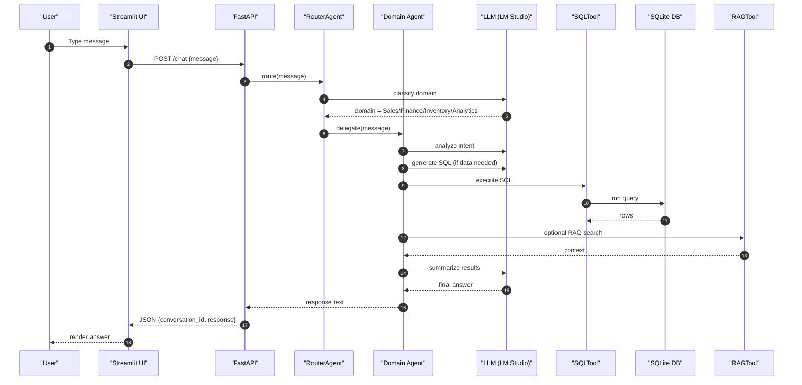

## Purpose

This document explains, in simple terms, how the application works end‑to‑end, the technologies we use, and how the codebase is organized. It is written for bootcamp students who are comfortable with Python and basic web concepts.

---

## High‑Level Overview

- **What it is**: An agent‑driven ERP prototype. You chat with the system and intelligent agents handle tasks across Sales, Finance, Inventory, and Analytics.
- **How it works**: A Streamlit UI talks to a FastAPI backend. The backend routes your message to the right domain agent. Agents can query a local SQLite database, optionally search documents (RAG), and use a local LLM (via LM Studio) to understand intent, generate SQL, and produce a helpful answer.
- **Why this design**: Natural language interfaces reduce friction. Agents encapsulate domain logic and tools, making the system modular and easy to extend.

---

## Architecture (End‑to‑End Flow)

1. You type a message in the Streamlit chat UI.
2. Streamlit calls the FastAPI backend endpoint (`/chat`).
3. The backend’s `RouterAgent` classifies which domain should handle the request (Sales, Finance, Inventory, or Analytics). It uses the local LLM for classification.
4. The selected domain agent (for example, `SalesAgent`) does the following:
   - Understands your intent using the LLM.
   - Generates a suitable SQL query with the LLM (when data is needed).
   - Executes the SQL using `SQLTool` against the SQLite database (`project_data/erp.db`).
   - Optionally uses `RAGTool` to retrieve relevant snippets from local documents.
   - Summarizes and explains results using the LLM, returning a clear answer.
5. FastAPI sends the agent’s response back to Streamlit, which renders it in the chat UI.

Visually:

```
Streamlit (chat) → FastAPI /chat → RouterAgent → Domain Agent
  → (LLM intent) → (LLM SQL) → SQLTool → SQLite
  → (optional RAG) → (LLM summarization) → reply
```

---

## Key Technologies and Libraries

- **Python**: Core language for the backend and agents
- **FastAPI**: Web framework for backend APIs (`/chat` and other endpoints)
- **Uvicorn**: ASGI server to run FastAPI
- **Streamlit**: Simple chat UI frontend
- **SQLite**: Lightweight database (`project_data/erp.db`) for ERP data
- **Requests**: HTTP client to call LM Studio’s local LLM API
- **Pydantic**: Data validation for request/response models
- **python‑dotenv**: Loads `.env` environment variables
- **LM Studio**: Runs a local LLM that we call via an OpenAI‑style `/v1/chat/completions` endpoint

Environment variables used:

- `LM_STUDIO_URL` (default `http://localhost:1234/v1/chat/completions`)
- `ERP_DB_PATH` (optional override for SQLite path)
- `GEMINI_API_KEY` (legacy; not used when LM Studio is active)

---

## Project Structure (Important Files)

- `app.py`: FastAPI application and endpoint wiring.
- `streamlit_app.py`: Streamlit chat UI calling the backend.
- `database.py`: Centralized SQLite connection and path resolution.
- `llm.py`: Helper functions to call LM Studio (OpenAI‑style chat API). Handles message formatting and errors.
- `agents/`:
  - `router_agent.py`: Decides which domain agent should handle a request.
  - `sales_agent.py`: Sales & CRM logic. Uses LLM for intent → LLM for SQL → SQLTool → result analysis via LLM.
  - `finance_agent.py`: Finance workflows (invoices, payments). Keyword scaffolding enhanced; extend similarly to Sales.
  - `inventory_agent.py`: Inventory/stock queries and demos.
  - `analytics_agent.py`: Revenue and KPI queries (daily/monthly/total, etc.).
- `tools/`:
  - `sql_tool.py`: Small helper for running SQL queries (read/write) safely.
  - `vector_rag_tool.py`: Vector-based Retrieval‑Augmented Generation using sentence-transformers and ChromaDB, with domain-specific tools.
- `models/common.py`: Pydantic models for API requests and responses.
- `project_data/erp.db`: Sample SQLite database with demo tables.
- `llm_benchmark.py`: Script to time LLM calls for simple/medium/complex prompts.
- `requirements.txt`: Python dependencies.

---

## Agent Design (What “Intelligent” Means Here)

Using `SalesAgent` as the concrete example (others follow a similar pattern):

- Intent understanding: `_analyze_intent(query)`
  - Sends a structured prompt to the LLM asking for an action classification and any filters.
  - Example actions: `retrieve_orders`, `retrieve_customers`, `new_lead`, `support_ticket`, etc.

- SQL generation: `_generate_sql_for_action(action_type, intent, original_query)`
  - Provides the DB schema to the LLM and asks it to write the SQL from scratch.
  - The prompt guides sorting, filtering (e.g., cancelled, recent, high_value), and an appropriate LIMIT policy.

- Data execution: `SQLTool.read(sql)` or `SQLTool.write(sql, params)`
  - Runs the generated SQL against SQLite.

- Result analysis: `_analyze_results_and_respond(rows, action_type, original_query, intent)`
  - Asks the LLM to summarize findings and explain the result in business language.

This design ensures the agent—not the user—does the heavy lifting: understanding intent, writing queries, and explaining results.

---

## Backend API Endpoints

- `POST /chat` (primary): Accepts a chat message. The router picks a domain agent, the agent does its work, and returns a response string plus a `conversation_id`.
- Domain‑specific endpoints may exist (or be added) for demos or tooling.

Example request body (Streamlit and tests use this):

```json
{ "message": "show me all cancelled orders" }
```

---

## Database and Data Access

- SQLite file: `project_data/erp.db`
- `database.py` locates the file relative to the repo root.
- Agents run SQL through `SQLTool` to keep DB interactions small and testable.
- Typical tables used in examples: `customers`, `orders`, `order_items`, `products`, `leads`, `tickets`.

---

## Local LLM via LM Studio

We call LM Studio’s local server with an OpenAI‑style chat API:

- URL: `LM_STUDIO_URL` (default `http://localhost:1234/v1/chat/completions`)
- Payload: `{ messages: [{role: "user", content: "..."}], temperature, top_p, max_tokens, stream }`

### Practical Settings for a GTX 1070 (8 GB VRAM)

- Keep model in memory: ON
- Offload KV cache to GPU: ON
- GPU offload: all layers if the model fits (e.g., 32/32)
- CPU thread pool size: 6 (matches a 6‑core i5‑8600K)
- Evaluation batch size: 64–128 for low latency
- Context length: 2048–4096 (reduce for speed if you do not need long history)
- Flash Attention: ON can help on many systems; if unstable, turn OFF
- K/V Cache Quantization: Experimental; try ON → if unstable, turn OFF

These are starting points; always test performance with `llm_benchmark.py`.

---

## Benchmarking the LLM

Use `llm_benchmark.py` to measure response time for three prompt types:

```bash
python llm_benchmark.py
```

It prints timings for:
- Simple (tiny reasoning)
- Medium (SQL generation)
- Complex (structured JSON inference)

This helps you tune LM Studio settings for your machine.

---

## Running the System Locally (Quick Start)

1. Create and activate a virtual environment, then install requirements:
   - Windows PowerShell:
     - `python -m venv venv`
     - `venv\Scripts\activate`
   - Install: `pip install -r requirements.txt`
2. Create `.env` (optional): set `LM_STUDIO_URL` if not using the default.
3. Start LM Studio’s server (select a chat‑capable model, start the local server).
4. Start the backend: `uvicorn app:app --reload`
5. Start Streamlit UI (optional demo): `streamlit run streamlit_app.py`

---

## Extending the System

- Add a new agent
  - Create a new file under `agents/` (e.g., `procurement_agent.py`).
  - Give it tools (SQL, RAG, ML) as needed.
  - Register it in the router so it can be selected.

- Add new tools
  - Implement under `tools/`, keep them small and testable.
  - Examples: forecasting, anomaly detection, embeddings/RAG.

- Evolve prompts
  - Improve intent, SQL, and summarization prompts.
  - Add guardrails: response schemas, stricter instructions, and validation.

---

## Troubleshooting Notes

- Database path errors → Confirm `database.py` resolves to `project_data/erp.db`.
- 500 errors from LLM calls → Check `LM_STUDIO_URL` and LM Studio logs.
- Slow responses → Tune LM Studio (batch size, threads, Flash Attention) and reduce `max_tokens` in `llm.py`.
- Model not found / API errors → Ensure the local server is running and reachable.

---

## What To Remember

- The router chooses the right agent.
- Agents, not users, generate SQL and explain results.
- Tools keep responsibilities clear: SQL for data, RAG for documents, LLM for reasoning.
- Everything runs locally to keep costs and privacy under control.

---

## Diagrams

### 1) System Architecture (High Level)

**Mermaid Diagram:**

```mermaid
graph LR
  "User" --> "Streamlit UI"
  "Streamlit UI" --> "FastAPI Backend (/chat)"
  "FastAPI Backend (/chat)" --> "RouterAgent"

  "RouterAgent" -->|"Sales"| "SalesAgent"
  "RouterAgent" -->|"Finance"| "FinanceAgent"
  "RouterAgent" -->|"Inventory"| "InventoryAgent"
  "RouterAgent" -->|"Analytics"| "AnalyticsAgent"

  "SalesAgent" --> "SQLTool"
  "FinanceAgent" --> "SQLTool"
  "InventoryAgent" --> "SQLTool"
  "AnalyticsAgent" --> "SQLTool"

  "SalesAgent" --> "RAGTool"
  "FinanceAgent" --> "RAGTool"
  "InventoryAgent" --> "RAGTool"
  "AnalyticsAgent" --> "RAGTool"

  "SalesAgent" --> "LLM (LM Studio)"
  "FinanceAgent" --> "LLM (LM Studio)"
  "InventoryAgent" --> "LLM (LM Studio)"
  "AnalyticsAgent" --> "LLM (LM Studio)"

  "SQLTool" --> "SQLite (project_data/erp.db)"
```

**ASCII Version (if Mermaid doesn't render):**
```
User → Streamlit UI → FastAPI Backend → RouterAgent
                                    ↓
                    ┌─────────────────────────────────┐
                    │  RouterAgent (Domain Selection) │
                    └─────────────────────────────────┘
                                    ↓
        ┌─────────────┬─────────────┬─────────────┬───────────────┐
        │ SalesAgent  │FinanceAgent │InventoryAgent│AnalyticsAgent│
        └─────────────┴─────────────┴─────────────┴───────────────┘
                    ↓
        ┌─────────────┬─────────────┬───────────────┐
        │   SQLTool   │   RAGTool   │LLM (LM Studio)│
        └─────────────┴─────────────┴───────────────┘
                    ↓
            SQLite Database
```

### 2) Request → Response Sequence

**Mermaid Diagram:**



**ASCII Version (if Mermaid doesn't render):**
```
1. User types message in Streamlit
2. Streamlit → FastAPI /chat endpoint
3. FastAPI → RouterAgent
4. RouterAgent → LLM (classify domain)
5. LLM → RouterAgent (domain = Sales/Finance/etc)
6. RouterAgent → Domain Agent
7. Domain Agent → LLM (analyze intent)
8. Domain Agent → LLM (generate SQL)
9. Domain Agent → SQLTool
10. SQLTool → SQLite Database
11. SQLite → SQLTool (return rows)
12. Domain Agent → RAGTool (optional)
13. Domain Agent → LLM (summarize results)
14. Domain Agent → FastAPI (response)
15. FastAPI → Streamlit (JSON response)
16. Streamlit → User (display answer)
```

### 3) Inside a Domain Agent (Pipeline)

**Mermaid Diagram:**

```mermaid
flowchart TD
  start["User query"] --> intent["LLM: Intent Classification"]
  intent --> action{Action type?}

  action -->|"Retrieve*"| sql["LLM: Generate SQL"]
  sql --> exec["SQLTool: Execute on SQLite"]
  exec --> summ["LLM: Summarize and explain"]
  summ --> end["Answer to user"]

  action -->|"Create lead/order/ticket"| summ
  intent --> rag["RAGTool: Retrieve context (optional)"] --> summ
```

**ASCII Version (if Mermaid doesn't render):**
```
User Query
    ↓
LLM: Intent Classification
    ↓
Action Type? (Retrieve* or Create)
    ↓
┌─────────────────┬─────────────────┐
│   Retrieve*     │     Create      │
│       ↓         │       ↓         │
│ LLM: Generate   │ LLM: Extract    │
│ SQL Query       │ Information     │
│       ↓         │       ↓         │
│ SQLTool: Execute│                 │
│ on SQLite       │                 │
│       ↓         │                 │
└─────────────────┴─────────────────┘
    ↓
LLM: Summarize and Explain
    ↓
Answer to User

Optional: RAGTool → Retrieve Context → Summarize
```


